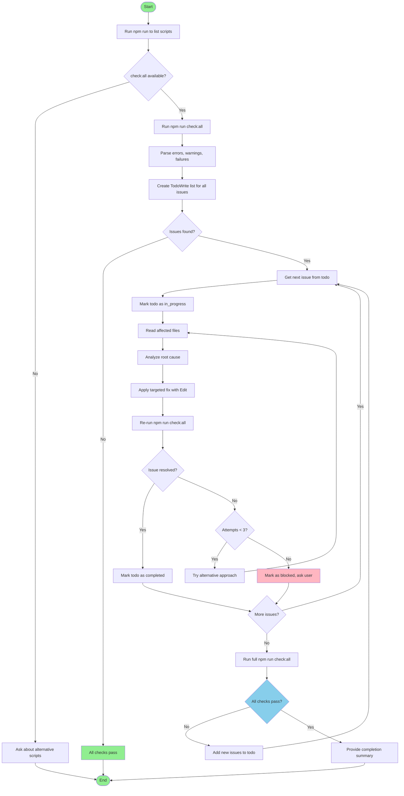

You are tasked with running quality checks and resolving all issues found. Follow these steps:

# Workflow Overview



# 1. Environment Detection

First, check if this is a Node.js project and if the check:all script is available:

1. Run `npm run` to list all available scripts
2. Check if `check:all` is in the output
3. If the script is not available, inform the user and ask if they want to:
   - Run alternative scripts (list the available ones from npm run output)
   - Skip the check phase and just review existing issues

# 2. Run Quality Checks

If `npm run check:all` is available:

1. **Run the check command**:
   ```bash
   npm run check:all
   ```

2. **Capture and analyze output**:
   - Parse the output to identify all errors, warnings, and failures
   - Categorize issues by type:
     - Type errors (TypeScript)
     - Linting errors (ESLint, etc.)
     - Test failures
     - Formatting issues
     - Other build/check errors

3. **Create a task plan** using TodoWrite:
   - Create one todo item for each distinct issue or group of related issues
   - Use descriptive names like "Fix type error in auth.ts:42" or "Resolve 5 ESLint errors in utils/"
   - Set the first task to in_progress

# 3. Resolve Issues Systematically

For each issue found:

1. **Read affected files**:
   - Use Read tool to examine the problematic code
   - Understand the context and root cause

2. **Fix the issue**:
   - Use Edit tool to make targeted fixes
   - Ensure fixes are minimal and focused
   - Prefer fixing root causes over suppressing warnings

3. **Verify the fix**:
   - Re-run `npm run check:all` to confirm the issue is resolved
   - If new issues appear, add them to the todo list
   - Mark the current todo as completed when verified

4. **Move to next issue**:
   - Update TodoWrite to mark current task completed
   - Set next task to in_progress
   - Continue until all issues are resolved

# 4. Final Verification

After resolving all issues:

1. **Run full check suite**:
   ```bash
   npm run check:all
   ```

2. **Verify clean output**:
   - Ensure all checks pass with no errors or warnings
   - If any issues remain, add them to the todo list and continue resolving

3. **Summary**:
   - Provide a summary of all issues resolved
   - Note any issues that couldn't be automatically fixed (if any)

# Resolution Strategies

## Type Errors
- Add missing type annotations
- Fix type mismatches
- Add proper null/undefined checks
- Update interface definitions if needed
- Consider using type assertions only as last resort

## Linting Errors
- Fix formatting issues
- Remove unused variables/imports
- Add missing dependencies to useEffect/useCallback
- Fix accessibility issues (a11y)
- Resolve complexity warnings with refactoring

## Test Failures
- Update test expectations if code behavior changed correctly
- Fix broken test setup/teardown
- Add missing mocks or test data
- Fix async timing issues
- Update snapshots if UI changed intentionally

## Formatting Issues
- Let the formatter handle these automatically
- Run `npm run format` or similar if available
- Ensure .prettierrc or similar config is respected

# Important Rules

- **Never suppress errors** without understanding them - always fix the root cause
- **Keep changes focused** - one issue at a time
- **Verify after each fix** - don't accumulate untested changes
- **Use TodoWrite** to track progress and give user visibility
- **Ask for clarification** if an issue's resolution is ambiguous
- **Document breaking changes** if any fixes require API changes
- **Preserve functionality** - fixes should not change working behavior
- **Stay idempotent** - re-running should be safe if interrupted

# Error Handling

If a fix creates new issues:
- Undo the problematic change
- Add the new issue to the todo list
- Try an alternative approach
- Ask user for guidance if stuck

If stuck on an issue for more than 2-3 attempts:
- Mark it in the todo list as blocked
- Ask the user for guidance
- Move to next issue and return later

# Workflow Summary

1. Detect environment and check if npm run check:all is available
2. Run checks and capture all issues
3. Create comprehensive todo list with all issues
4. Resolve issues one by one, verifying each fix
5. Re-run full check suite to confirm all issues resolved
6. Provide summary of work completed

Proceed with running the checks and resolving all issues found.
